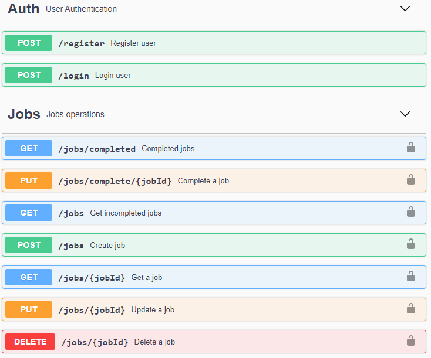

<div align="center">
    
    <h1 align="center">SALARYFY</h1>
    <p>Salaryfy App is an application for freelance developers, easily track your working time and earnings.</p>
</div>

### Table of contents

- [Frontend](#frontend-%EF%B8%8F)
- [Backend](#backend-%EF%B8%8F)
  - [Getting Started](#getting-started-)
  - [Installation](#installation-)
  - [Run proyect](#run-proyect-)
    - [Build](#build)
- [Swagger API Documentation](#swagger-api-documentation-)
- [Dependencies](#dependencies-%EF%B8%8F)
- [Contact](#contact-%EF%B8%8F)

---

## Frontend 🗡️

Soon.

## Backend 🛡️

### Getting Started 🚀

These instructions will get you a copy of the project up and running on your local machine.

### Installation 🔧

1. Clone the repo

```sh
git clone https://github.com/jonathanmejia-ar/salaryfy-app.git
```

2. Enter backend directory

```sh
cd backend
```

3. Install NPM packages

```sh
npm install
```

4. Read `env.example` and create a `.env` file with your environment variables.

### Run proyect 💻

- Start local server
  ```sh
  npm run dev
  ```

#### Build

- Build for deploy
  ```sh
  npm run build
  ```

## Swagger API Documentation 📄

- Running by default in `http://localhost:3000/v1/api-docs`



- [Markdown Documentation](backend/src/docs/swagger.md)

## Dependencies 🛠️

- [express](https://www.npmjs.com/package/express) - NodeJs Framework used for handling and routing HTTP requests.
- [babeljs](https://babeljs.io/docs/en/usage) - Compile your JavaScript application code that uses ES2015+ syntax into code that works in current browsers.
- [mongoose](https://www.npmjs.com/package/mongoose) - Mongoose is a MongoDB object modeling tool designed to work in an asynchronous environment.
- [passport](https://www.npmjs.com/package/passport) - Express-compatible authentication middleware for Node.js.
- [passport-jwt](https://www.npmjs.com/package/passport-jwt) - Passport strategy for authenticating with a JSON Web Token.
- [winston](https://www.npmjs.com/package/winston) - Universal logging library with support for multiple transports.
- [bcryptjs](https://www.npmjs.com/package/bcryptjs) - Library to help you hash passwords.
- [jsonwebtoken](https://www.npmjs.com/package/jsonwebtoken) - Open JSON-based standard proposed by IETF for token creations.
- [express-validator](https://www.npmjs.com/package/express-validator) - An express.js middleware for validator.
- [helmet](https://www.npmjs.com/package/helmet) - Helps you secure your Express apps by setting various HTTP headers.
- [moment](https://www.npmjs.com/package/moment) - A JavaScript date library for parsing, validating, manipulating, and formatting dates.
- [http-errors](https://www.npmjs.com/package/@curveball/http-errors) - This package contains a list of standard HTTP exceptions for Typescript.
- [swagger-ui-express](https://www.npmjs.com/package/swagger-ui-express) - Allows you to serve auto-generated swagger-ui generated API docs from express, based on a swagger.json file.

## Contact ✉️

If you want to contact me you can reach me at <jonathanmejia.ar@gmail.com>.
